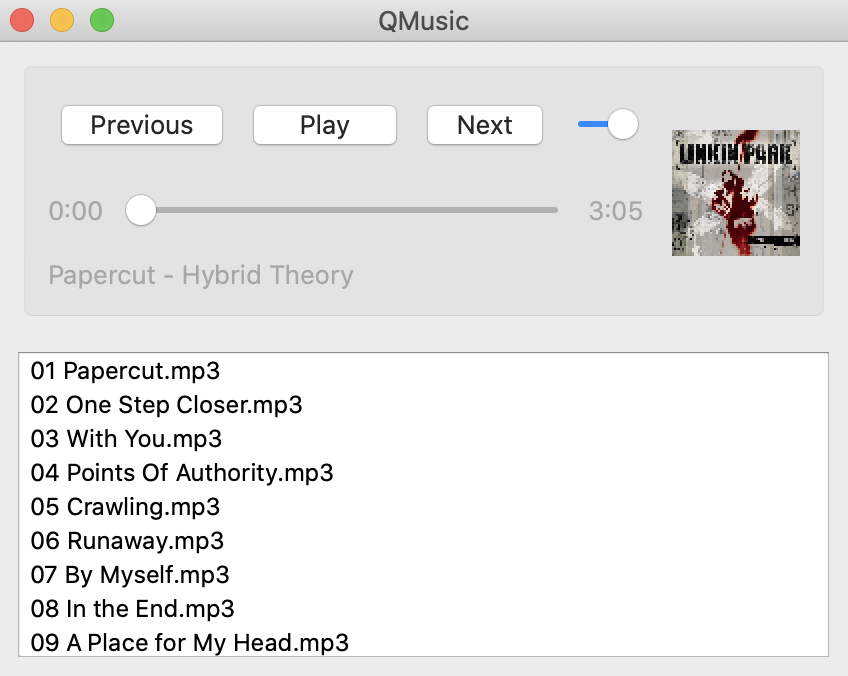

# QMusic

QMusic is a simple application for audio playback written in Python using the PySide2 Qt5 framework.

*Please note: PySide2 version 5.14 or lower is used as of now due to a bug in QtMultimedia leading to QUrls containing spaces not working in Qt 5.15.*

# Dependencies

Python 3.5 or newer with `python` or `python3` available in your path along with Python setuptools.

`python3 setup.py install` - install the required packages

# Running

`python3 setup.py run` - run the program using the Python interpreter

# Screenshots

# Other Environment Commands

`python3 setup.py clean` - clean the build environment

`python3 setup.py build_exec` - build an executable for the current platform, should output to the `dist` directory and may require sudo on some systems

`sudo python3 setup.py build_exec -a` - write a script to /usr/local/bin on Unix-like systems from which QMusic is launched

`python3 setup.py py2app` - build a macOS app

`python3 setup.py py2app -A` - build a macOS app in alias mode, requiring the local files to still be in place

`python3 setup.py run -e` - run the built executable, app or link mode executable which will be detected

For more info, run `python3 setup.py --help`

For more commands, run `python3 setup.py --help-commands`

# Other Notes

There is a token for the lyrics from Genius in the ` ` variable of `src/lib.py`, however if the token in here is invalid, you can replace it with your own by using the Genius API from their website. The documentation can also be found in `reference.txt`.

_______________________

# Old commands

**Please note, compilation is currently broken due to Nuitka not supporting PySide2/Shiboken2.**

~~`python3 setup.py compile` - build an executable using Nuitka~~
